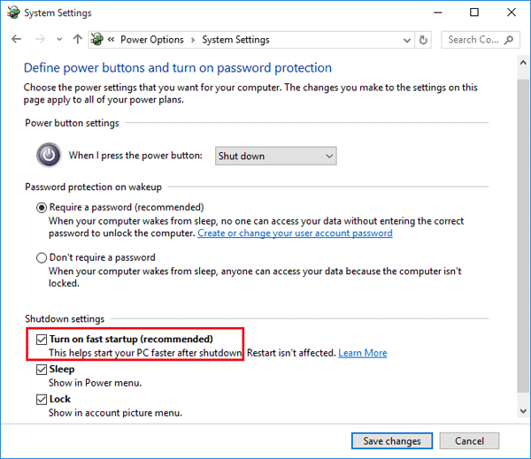

# How to fix some errors

## Change the UEFI partition during the instalation of Windows
* Remove the partition with label = System (it is 100M size)
* Open console (Press Shift + F10)
* Open partition program - `diskpart.exe`
* List disks - `list disk`
* Select disk - `select disk n` where `n` is the disk where you will create the partition
* Create efi partition - `create partition efi size=550M`
* Format the new partition - `format quick fs=fat32 label=System`
* close the program - `exit`
* Click on the refresh button

---

## Disable quick start in windows
* Go to Power options
* System seetings
* Define power button and turn on password protection
* Unmark the checkbox Turn on fast startup

---

## Linux images not found or do not exist
1. Unmount the UEFI partition - `umount /boot`
2. download the linux image - `mkinitcpio -P`
3. Go to `/boot` and move the above files to anoter folder (example: `mv /boot/initramfs-linux-fallback.img /home/` and `mv /boot/initramfs-linux.img /home/`)
4. Mount again the UEFI partition - `mount /dev/<partition_name> /boot`
5. Move again the files (example: `mv /home/initramfs-linux-fallback.img /boot/` and `mv /home/initramfs-linux.img /boot/`)

Now the linux images will be recogniced by grub